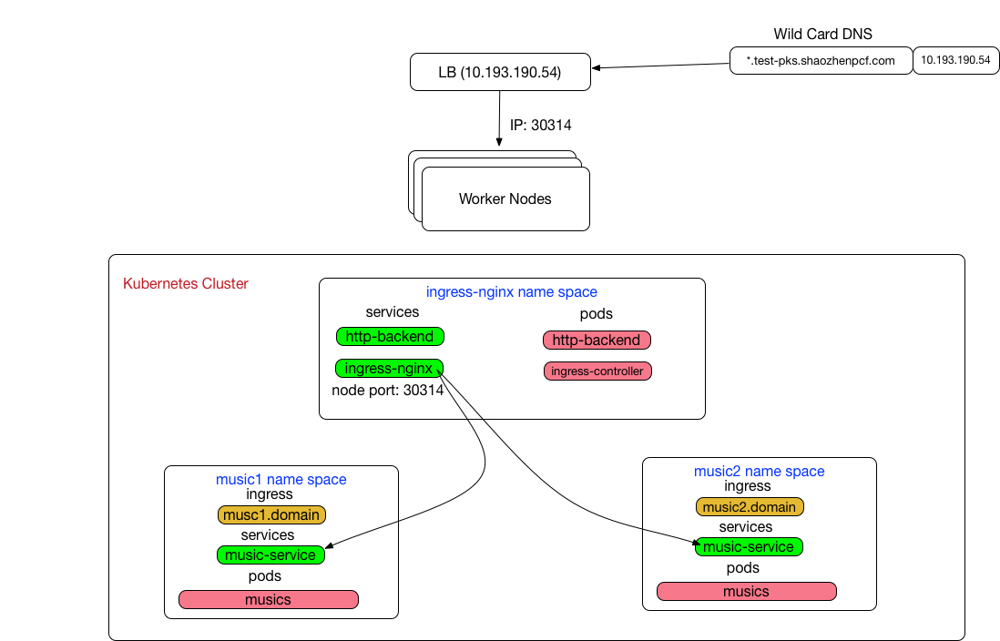

# ingress-kubo-poc

## Problems/Challenges

Assume there is no Kubernetes Cloud Provider Load Balancers available

* Have to use node port service to gain ingress traffic
* Have to manually configure an external load balancer for ingress traffic

## Solutions with ingress




Service Networking References:

* [Kubernetes ingress](https://kubernetes.io/docs/concepts/services-networking/ingress/)
* [Kubernetes ingress nginx](https://github.com/kubernetes/ingress-nginx)
* [Kubernetes ingress istio](https://istio.io/docs/tasks/traffic-management/ingress.html)

## Infrastructure Prerequisites

* A Load Balancer front end port 80
* A wild card DNS record point to the load Balancer

## Deploy Samples

### Install ingress-nginx

```
./install-ingress-nginx.sh
```
### Install ingress-istio

```
curl -L https://git.io/getLatestIstio | sh -
kubectl apply -f install/kubernetes/istio.yaml
```

### Setup Load Balancer to worker node

#### nginx

```
kubectl get services -n ingress-nginx
NAME                   TYPE        CLUSTER-IP       EXTERNAL-IP   PORT(S)                      AGE
default-http-backend   ClusterIP   10.100.200.140   <none>        80/TCP                       3h
ingress-nginx          NodePort    10.100.200.28    <none>        80:30314/TCP,443:32524/TCP   3h
```

```
kubectl get pods -n ingress-nginx
NAME                                        READY     STATUS    RESTARTS   AGE
default-http-backend-55c6c69b88-jwwlv       1/1       Running   0          3h
nginx-ingress-controller-6844dff6b7-9zzft   1/1       Running   0          3h
```

Point the Load Balancer to all the worker nodes IP:NodePort (30314 and 32524)

#### istio

```
kubectl get service istio-ingress -n istio-system
NAME            TYPE           CLUSTER-IP      EXTERNAL-IP   PORT(S)                      AGE
istio-ingress   LoadBalancer   10.100.200.56   <pending>     80:31385/TCP,443:30138/TCP   2m
```

Point the Load Balancer to all the worker nodes IP:NodePort (31385 and 30138)

### Deploy multiple apps behind same load balancer

```
kubectl create -f music1/namespace.yml
kubectl create -f music1/music.yml
```

```
kubectl get services -n music1
NAME            TYPE        CLUSTER-IP      EXTERNAL-IP   PORT(S)    AGE
music-service   ClusterIP   10.100.200.63   <none>        8080/TCP   2h
```

Provide the ingress rule based on the host header

[ingress-nginx.yml](music1/ingress-nginx.yml)
```
kubectl create -f music1/ingress-nginx.yml
```

__OR__

[ingress-istio.yml](music1/ingress-istio.yml)
```
kubectl create -f music1/ingress-istio.yml
```

Create another app
```
./install-music.sh music2 istio/nginx
```

### Access Spring Music

```
http://music1.test-pks.shaozhenpcf.com
http://music2.test-pks.shaozhenpcf.com
```
